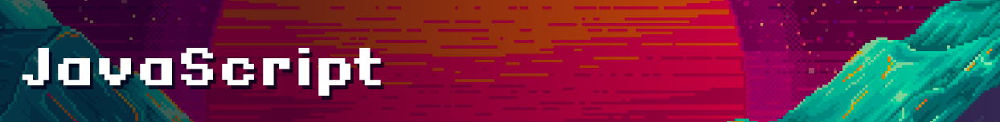

# 💻 JavaScript 101 — The Origins Trilogy

  

This repository contains the exercises and mini-projects I’ve completed during the [Codedex](https://www.codedex.io/@CrisU8) JavaScript 101 course — part of **The Origins Trilogy**, a foundational web development series.

---

## 📘 Course Chapters

---

### 1️⃣ [Console](./01-console)

> 🖨️ The `console.log()` method outputs messages to the browser's console.  
> 💡 JavaScript executes code one line at a time, from top to bottom.  
> 💬 Single-line comments are written using `//`, while multi-line comments are wrapped in `/* */`.

🎯 This chapter introduced the basics of how JavaScript communicates with us and how we, as developers, can leave notes or disable code for testing. It set the stage for writing our first interactive programs!

---

### 2️⃣ [Variables](./02-variables)

> 🧠 We explored two main ways to declare variables: `let` and `const`.  
> 🔢 Data types included: **Numbers**, **Strings**, **Booleans**, **Null**, and **Undefined**.  
> ➕ Arithmetic operators: `+`, `-`, `*`, `/`  
> 🧮 The `%` (modulo) operator returns the remainder of division.  
> ✨ The `**` (exponentiation) operator raises one number to the power of another.

🎯 By mastering variables and data types, we unlocked the ability to store and manipulate information in our programs.

---

### 3️⃣ [Conditionals](./03-conditionals)

> 🧭 Conditionals control the flow of code based on **truthy** or **falsy** conditions.  
> 🔍 `if` statements execute code only if the condition is true.  
> 🔄 `else if` allows checking multiple conditions in order.  
> ❗ `else` runs if none of the previous conditions are true.  
> 🧪 Comparison operators: `===`, `!==`, `>`, `>=`, `<`, `<=`  
> ⚙️ Logical operators: `&&` (and), `||` (or), `!` (not)

🎯 With conditionals, we learned how to make our programs react dynamically to different situations.

---

### 4️⃣ [Loops](./04-loops)

> 🔁 Loops let us repeat operations efficiently.  
> 🔄 `while` loops run as long as a condition remains true.  
> ➰ `for` loops repeat for a specific number of times using an iterator.  
> ⏭️ `continue` skips the current iteration if a condition is true.  
> 🛑 `break` exits the loop entirely when triggered.

🎯 This chapter gave us the tools to automate repetition, handle sequences, and make smarter programs.

---

### 🧩 [Combined Practice Projects](./checkpoints-projects)

After completing chapters 1–4, I worked on a series of classic JavaScript challenges — including **FizzBuzz**, **Horoscope**, and a **Leap Year Checker** — to reinforce everything I’d learned about variables, conditionals, and loops.

🧠 **Skills practiced:** loops, control flow, logical operators, `Math.random()`, modulo `%`, and nested conditions

---

### 5️⃣ [Arrays](./05-arrays)

> 📦 Arrays let us group and manage multiple values in a single variable.  
> 📌 We accessed elements using square brackets `[]` and the `.length` property.  
> ➕ Methods to add: `.push()` (end), `.unshift()` (start)  
> ➖ Methods to remove: `.pop()` (end), `.shift()` (start)  
> 🔍 We used `.includes()` and `.indexOf()` to check for the existence of elements.

🎯 Arrays are foundational to data manipulation and are key to building dynamic, scalable programs.

---

  

